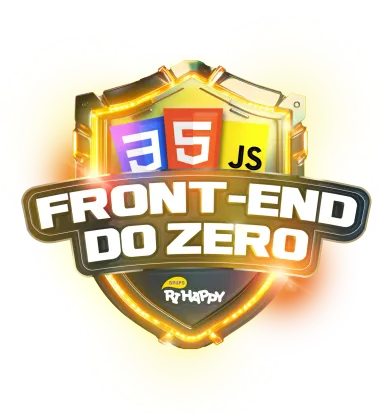

<h1> Bootcamp Front-end do Zero - Ri Happy </h1>

 

*Bootcamp* EAD oferecido pela *Digital Innovation One* (DIO), em parceria com a Ri Happy. Esse curso tem como objetivo ensinar os fundamentos de HTML, CSS e JavaScript, através de uma base estruturada de conteúdos e projetos práticos, incluindo páginas *web* responsivas e dinâmicas.

 

**Início**: 29/10/2024 | **Término**: 15/12/2024

**Carga Horária**: 75 horas

 

## 📝 Atividades
 

**1. Princípios de desenvolvimento de *software* colaborativo**

* Introdução ao desenvolvimento front-end com a Ri Happy ✔️
* Entendendo comunicação *client-server* ✔️
* Versionamento de código com Git e GitHub ✔️
* Desafios de projetos: crie um portfólio vencedor ✔️
* **Desafio**: Contribuindo em um projeto *Open Source* no GitHub ✔️

 
 

**2. Desenvolvendo suas primeiras páginas com HTML e CSS**
* Introdução ao HTML na prática ✔️ 
* Trabalhando com formulários em HTML ✔️ 
* Estruturando seu HTML + formatações ✔️ 
* Entendendo HTML semântico ✔️ 
* Fundamentos do CSS ✔️ 
* Estilizações básicas com CSS ✔️ 
* Desafios de código: aperfeiçõe sua lógica e pensamento computacional ✔️ 
* **Desafio de código**: Explorando HTML e CSS com lógica de programação ✔️ 
* **Desafio**: [Criando sua primeira *landing page* com HTML e CSS](https://github.com/biachristie/dio-bootcamp-frontend-do-zero/tree/main/Desafio_03) ✔️
* **Desafio**: [Criando um jogo do Detona Ralph com JavaScript](https://github.com/biachristie/dio-bootcamp-frontend-do-zero/tree/main/Desafio_04) ✔️

 
 

**3. Aprendendo lógica de programação**
* Entendendo algoritmos e fluxogramas ✔️
* Estrutura de um *software* e seu ambiente de desenvolvimento ✔️
* Trabalhando com variáveis ✔️
* Criando e manipulando vetores e matrizes ✔️
* Trabalhando com estruturas condicionais (if, else if, else) ✔️
* Trabalhando com estruturas de decisão (estrutura switch case) ✔️
* Trabalhando com estruturas de repetição (for, while, do-while) ✔️
* **Desafio de código**: Explorando fundamentos de lógica com JavaScript ✔️
* **Desafio**: [Classificador de nível de herói](https://github.com/biachristie/dio-bootcamp-frontend-do-zero/tree/main/Desafio_06) ✔️
* **Desafio**: [Criando um jogo da memória com *emojis* utilizando JavaScript](https://github.com/biachristie/dio-bootcamp-frontend-do-zero/tree/main/Desafio_07) ✔️

 
 

**4. Dando seus primeiros passos com JavaScript**
* Primeiros passos com JavaScript ✔️
* Conhecendo funções JavaScript ✔️
* Criando objetos e classes com JavaScript ✔️
* Arrays e estruturas de repetição em JavaScript ✔️
* **Desafio de código**: Técnicas de programação com funções e classes ✔️
* Introdução ao desenvolvimento web com JavaScript ✔️
* Criando um projeto com HTML/CSS para listagem de Pokémon ✔️
* Dominando o protocolo HTTP e integrando com a PokeAPI ✔️
* **Desafio**: [Construindo uma Pokédex com JavaScript](https://github.com/biachristie/javascript-pokedex) ✔️
* **Desafio**: [Criando um jogo de cartas do Yu-Gi-Oh! com JavaScript e CSS](https://github.com/biachristie/dio-bootcamp-frontend-do-zero/tree/main/Desafio_10) ✔️

 
 

**5. Construindo seu primeiro portfólio front-end**
* **Desafio**: [Construindo um simulador de piano com JavaScript e CSS](https://github.com/biachristie/dio-bootcamp-frontend-do-zero/tree/main/Desafio_11) ✔️
* **Desafio**: [Construindo uma *landing page* no mundo invertido com HTML e CSS](https://github.com/biachristie/dio-bootcamp-frontend-do-zero/tree/main/Desafio_12) ✔️
* **Desafio**: [Multiverso Spider-Man: criando um *site* com HTML, CSS e JavaScript](https://github.com/biachristie/dio-bootcamp-frontend-do-zero/tree/main/Desafio_13) ✔️
* **Desafio**: [Construindo um portfólio front-end do zero com HTML, CSS e JavaScript]() 

 
 

**6. Mentorias**
* *Live* de lançamento - *Bootcamp* Ri Happy Front-end do zero - Iglá Generoso, Alexandre Carrão e Paulo Farroco ✔️
* Integração da área de negócios com tecnologia em um *e-commerce* e seus impactos - Renata Francisco Barreiro ✔️
* Recriando o carrossel de vendas do *site* da Ri Happy com HTML, CSS e JS - Jeferson Duarte ✔️
* Hábitos de um desenvolvedor de sucesso na Ri Happy - Leonardo Medina, Marcus Maia e Marcia Fernandes ✔️